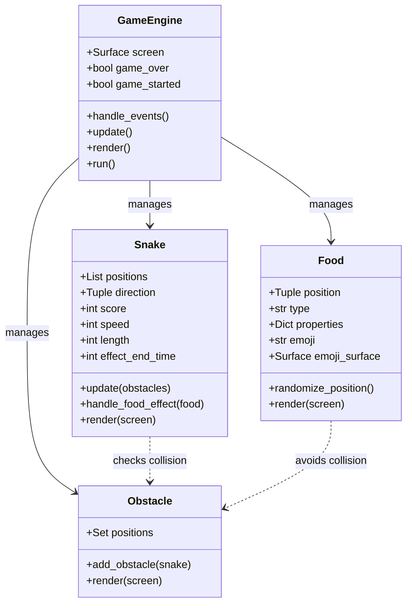
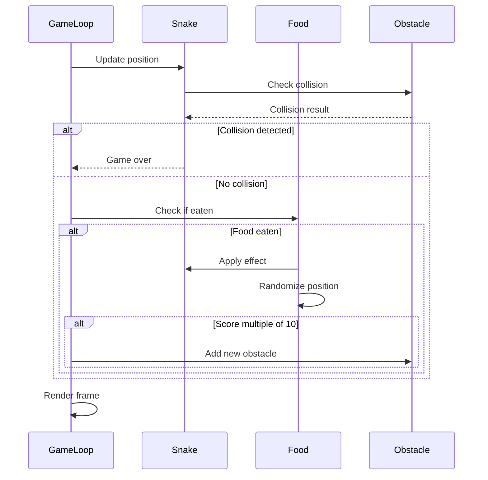
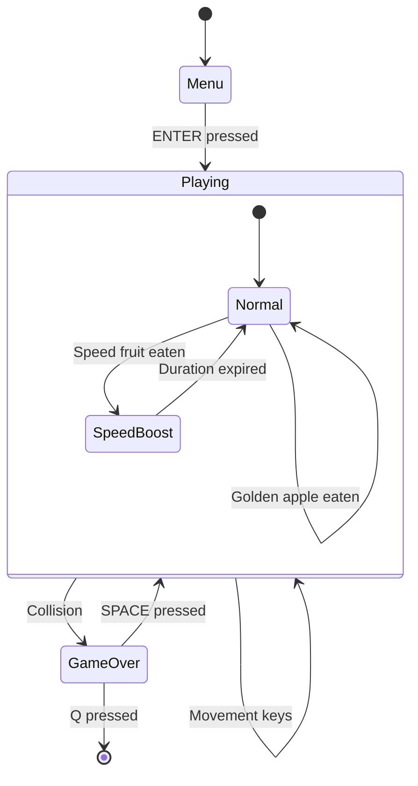
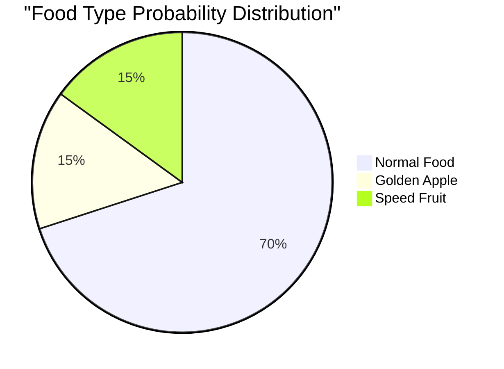

# Snake Game Architecture Document

## Project Overview
Modern Snake Game is a Python-based implementation of the classic Snake game, featuring modern graphics, special effects, and enhanced gameplay mechanics.

## Directory Structure
```
snake/
├── src/                    # Source code directory
│   ├── __init__.py        # Package initialization
│   ├── constants.py       # Game constants and configurations
│   ├── snake.py          # Snake class implementation
│   ├── food.py           # Food class implementation
│   └── obstacle.py       # Obstacle class implementation
├── sounds/                # Sound effects directory
│   ├── eat.wav           # Food consumption sound
│   ├── crash.wav         # Collision sound
│   └── background.wav    # Background music
├── snake_game.py         # Main game entry point
├── test_snake_game.py    # Unit tests
└── README.md             # Project documentation
```

## Core Components

### 1. Game Engine (snake_game.py)
- **Responsibility**: Main game loop and state management
- **Key Features**:
  - Game state handling (menu, playing, game over)
  - Event processing
  - Rendering coordination
  - Sound system management

### 2. Snake (src/snake.py)
- **Responsibility**: Snake behavior and properties
- **Key Features**:
  - Movement mechanics
  - Growth system
  - Collision detection
  - Special effects handling (speed modifications)
- **State Management**:
  - Position tracking
  - Length
  - Speed
  - Score
  - Effect timers

### 3. Food System (src/food.py)
- **Responsibility**: Food item management
- **Types**:
  - Normal Food (70% chance)
    - +1 point
    - Regular speed
  - Golden Apple (15% chance)
    - +2 points
    - Regular speed
  - Speed Fruit (15% chance)
    - +1 point
    - Temporary speed boost
- **Features**:
  - Random position generation
  - Collision avoidance with obstacles
  - Type-specific effects
  - Visual representation with emojis

### 4. Obstacle System (src/obstacle.py)
- **Responsibility**: Obstacle management
- **Features**:
  - Dynamic obstacle placement
  - Collision detection
  - Progressive difficulty (new obstacles added every 10 points)

### 5. Constants (src/constants.py)
- **Responsibility**: Game configuration and constants
- **Categories**:
  - Window dimensions
  - Grid settings
  - Colors
  - Game speeds
  - Food properties
  - Direction vectors

## Game Mechanics

### Movement System
- Grid-based movement
- Four directions (UP, DOWN, LEFT, RIGHT)
- Boundary wrapping (snake passes through walls)
- Smooth controls with immediate response

### Scoring System
- Normal food: +1 point
- Golden apple: +2 points
- Score display in real-time
- High score tracking

### Special Effects System
- **Speed Boost**:
  - Duration: 5 seconds
  - Speed increase: +2 units
  - Automatic reversion to normal speed
- **Visual Feedback**:
  - Unique colors for different food types
  - Emoji-based food representation
- **Sound Effects**:
  - Eating sound
  - Collision sound
  - Background music

## System Architecture Diagrams

### Class Diagram


### Component Interaction


### State Diagram


### Food Type Distribution


## Testing Architecture

### Unit Tests (test_snake_game.py)
- **Core Functionality Tests**:
  - Snake movement
  - Collision detection
  - Food generation
  - Obstacle placement
- **Special Feature Tests**:
  - Food type properties
  - Special effects
  - Score calculation
  - Speed modifications

## Future Enhancements
1. **Planned Features**:
   - Leaderboard system
   - Additional power-ups
   - Multiple difficulty levels
   - Custom themes

2. **Technical Improvements**:
   - Save/load game state
   - Configuration file support
   - Performance optimizations
   - Mobile device support

## Design Patterns
- **Singleton**: Game state management
- **Observer**: Event handling system
- **Factory**: Food type generation
- **State**: Game state transitions

## Dependencies
- Python 3.x
- Pygame: Graphics and sound
- Pygame-emojis: Food visualization

## Development Guidelines
1. **Code Style**:
   - Follow PEP 8
   - Use type hints
   - Document all classes and methods

2. **Testing**:
   - Write tests for new features
   - Maintain test coverage
   - Test edge cases

3. **Version Control**:
   - Feature branches
   - Descriptive commit messages
   - Regular testing before commits
