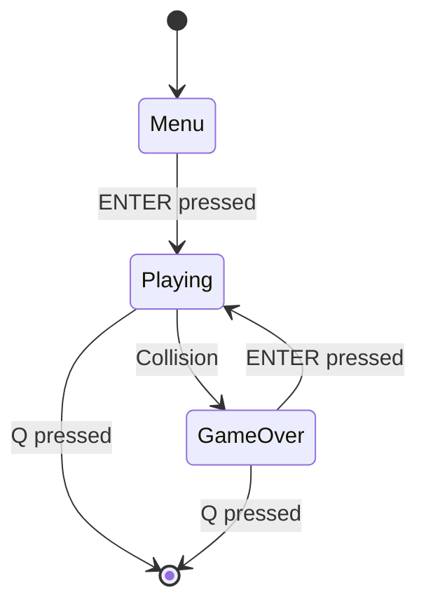

# Snake Game Architecture Document

## Project Overview
Modern Snake Game is a Python-based implementation of the classic Snake game, featuring modern graphics, special effects, and enhanced gameplay mechanics.

## Directory Structure
```
snake/
├── src/                    # Source code directory
│   ├── __init__.py        # Package initialization
│   ├── constants.py       # Game constants and configurations
│   ├── snake.py          # Snake class implementation
│   ├── food.py           # Food class implementation
│   ├── obstacle.py       # Obstacle class implementation
│   ├── game_state.py     # Game state management
│   ├── sound.py          # Sound system implementation
│   └── ui.py             # UI system implementation
├── tests/                 # Test suite directory
│   ├── test_base.py      # Base test class with common utilities
│   ├── unit/             # Unit tests directory
│   │   ├── test_snake.py     # Snake component tests
│   │   ├── test_food.py      # Food system tests
│   │   └── test_obstacle.py  # Obstacle system tests
│   └── integration/      # Integration tests directory
│       ├── test_game_mechanics.py  # Game mechanics tests
│       └── test_ui.py           # UI rendering tests
├── sounds/                # Sound effects directory
│   ├── eat.wav           # Food consumption sound
│   ├── crash.wav         # Collision sound
│   └── background.wav    # Background music
├── docs/                 # Documentation assets
│   └── screenshot.png    # Game screenshot
├── snake_game.py         # Main game entry point
└── README.md             # Project documentation

```

## Core Components

### 1. Game Engine (snake_game.py)
- **Responsibility**: Main game loop and event handling
- **Key Features**:
  - Event processing
  - Component coordination
  - Game initialization

### 2. Game State (src/game_state.py)
- **Responsibility**: Game state management
- **Key Features**:
  - Game state transitions (menu, playing, paused, game over)
  - Score tracking and high score persistence
  - Game reset functionality
  - State validation

### 3. Sound System (src/sound.py)
- **Responsibility**: Audio management
- **Key Features**:
  - Sound effect loading and playback
  - Background music control
  - Volume management
  - Error handling for missing files

### 4. UI System (src/ui.py)
- **Responsibility**: Visual rendering
- **Components**:
  - GameRenderer: Game screen rendering
  - Screenshot: Screenshot capture system
- **Features**:
  - Menu screens (start, game over)
  - Game state visualization
  - Score display
  - Screenshot scheduling and capture

### 5. Snake (src/snake.py)
- **Responsibility**: Snake behavior and properties
- **Key Features**:
  - Movement mechanics
  - Growth system
  - Collision detection
  - Special effects handling
- **State Management**:
  - Position tracking
  - Length
  - Base and current speed
  - Score
  - Effect timers

### 6. Food System (src/food.py)
- **Responsibility**: Food item management
- **Types**:
  - Normal Food (40% chance)
    - +1 point
    - Regular speed
    - Emojis: 🍕🍇🍪🍓
  - Golden Food (20% chance)
    - +2 points
    - Regular speed
    - Emojis: 🌟⭐🌞
  - Speed Food (20% chance)
    - +1 point
    - Temporary speed boost
    - Emojis: ⚡🚀💨
  - Slow Food (20% chance)
    - +1 point
    - Temporary speed reduction
    - Emojis: 🐌🦥🐢
- **Features**:
  - Random position generation
  - Collision avoidance with obstacles
  - Type-specific effects and durations
  - Visual representation with emojis
  - Effect stacking with base speed

### 7. Obstacle System (src/obstacle.py)
- **Responsibility**: Obstacle management
- **Features**:
  - Dynamic obstacle generation
  - New obstacle every 10 points
  - Collision detection
  - Position validation
  - Grid-based positioning

### 8. Constants (src/constants.py)
- **Responsibility**: Game configuration and constants
- **Categories**:
  - Window dimensions
  - Grid settings
  - Colors and visuals
  - Game speeds and limits (2-12)
  - Food properties and effects
  - Direction vectors
  - Sound settings
  - Score thresholds

## Testing Architecture

### Base Test Class (tests/test_base.py)
- **Responsibility**: Common test functionality
- **Features**:
  - Pygame initialization/cleanup
  - Test environment setup
  - Common assertions
  - Utility methods

### Unit Tests
- **Snake Tests** (test_snake.py):
  - Movement mechanics
  - Collision detection
  - Growth behavior
  - Speed modifications
  
- **Food Tests** (test_food.py):
  - Food generation
  - Effect application
  - Position randomization
  - Type distribution
  
- **Obstacle Tests** (test_obstacle.py):
  - Placement validation
  - Collision detection
  - Position management

### Integration Tests
- **Game Mechanics** (test_game_mechanics.py):
  - State transitions
  - Score calculation
  - Speed effects
  - Food interactions
  - Reset functionality
  - Direction changes
  - Obstacle generation
  
- **UI Tests** (test_ui.py):
  - Menu rendering
  - Game screen rendering
  - Score and high score display
  - Timer display
  - Game over screen

## Game States and Transitions

