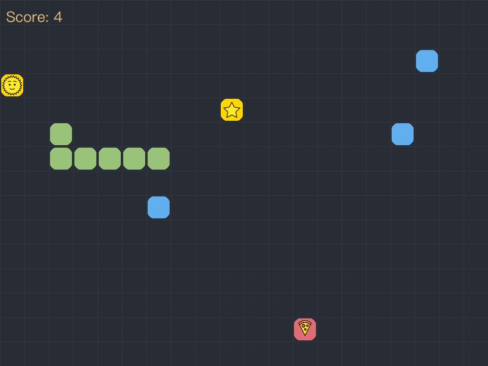

# Modern Python Snake Game

A modern take on the classic Snake game, built with Python and Pygame. Experience smooth animations, dynamic visuals, and engaging gameplay mechanics.



## Quick Start

```bash
# Clone the repository
git clone https://github.com/yourusername/snake-game.git
cd snake-game

# Set up Python environment
python -m venv venv
source venv/bin/activate  # On Windows: venv\Scripts\activate

# Install dependencies
pip install -r requirements.txt

# Launch the game
python snake_game.py
```

## Gameplay

### Controls
| Key | Action |
|-----|--------|
| ENTER | Start game / Restart after game over |
| ↑ | Move up |
| ↓ | Move down |
| ← | Move left |
| → | Move right |
| Q | Quit game |

### Power-ups and Scoring
The game features four types of collectible food items:

- 🍕 **Normal Food**
  - Basic food items (🍕🍇🍪🍓)
  - Adds 1 point to score
  - Increases snake length

- 🌟 **Golden Food**
  - Rare, valuable food items (🌟⭐🌞)
  - Adds 2 points to score
  - Increases snake length

- ⚡ **Speed Food**
  - Speed boost power-up (⚡🚀💨)
  - Temporarily increases snake speed
  - Adds 1 point to score
  - Effect duration is temporary

- 🐌 **Slow Food**
  - Speed reduction power-up (🐌🦥🐢)
  - Temporarily decreases snake speed
  - Adds 1 point to score
  - Effect duration is temporary

### Game Mechanics
- Snake wraps around screen edges for continuous gameplay
- Colliding with obstacles or snake's body ends the game
- Score increases based on food type collected
- Speed effects are temporary and stack with base speed
- Base speed increases every 10 points
- High score system tracks best performance
- Game timer shows elapsed time
- Background music and sound effects enhance the experience

## Acknowledgments

### Music
- Background Music: ["The Snake Game (original GB music)"](https://youtu.be/FpDWpX9luCQ?si=zP7c-KROsUjh8SQ5) by Zuka

## Development

### Prerequisites
- Python 3.11 or higher
- Pygame library
- Virtual environment (recommended)

### Project Structure
```
snake/
├── src/               # Source code
│   ├── snake.py      # Snake class and movement logic
│   ├── food.py       # Food types and effects
│   └── obstacle.py   # Obstacle generation and collision
├── tests/            # Test suite
│   ├── unit/        # Unit tests
│   └── integration/ # Integration tests
├── sounds/           # Audio files
├── requirements.txt  # Dependencies
└── README.md        # Documentation
```

### Running Tests
The project includes comprehensive unit and integration tests:

```bash
# Run all tests
python -m unittest discover tests -v

# Run specific test categories
python -m unittest tests/unit/test_snake.py -v     # Snake mechanics
python -m unittest tests/unit/test_food.py -v      # Food effects
python -m unittest tests/unit/test_obstacle.py -v  # Obstacle behavior
python -m unittest tests/integration/*.py -v       # Integration tests
```